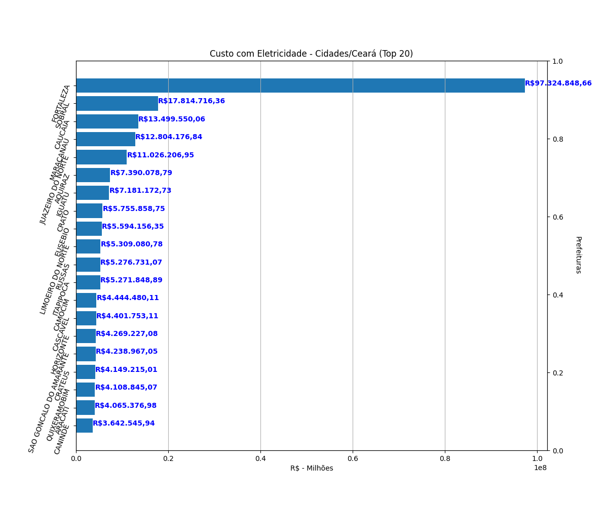

# Despesas com Eletricidade - 2020

## Overview

Este pequeno projeto "nasceu" da necessidade de avaliar os custos energéticos dos municípios cearenses.

### São três processos

1. Extração dos dados do site do TCM- CE;
2. Tratamento dos dados, para calcular e ordenar as cidades em ordem decrescente;
3. Plotar o gráfico Bar.

O resultado pode ser visto na imagem a sequir.

<div align="center">
    <kbd>
        
    </kbd>
</div>

## Tecnologias

A linguagem de programação usada é a Python. As dependências podem ser vistas no arquivo requirements.txt.

Para salvar os dados extraídos, a opção foi MongoDB, que deve estar ativo em sua máquina.

## Iniciar

Clone o projeto para a sua máquina, entre no diretório do projeto e execute:

Antes, é indicato criar um ambiente virtual para o projeto.

```
pip install -r requirements.txt

```
Depois:

```
python3 app.py

```

Seja meu convidado para questinamentos.